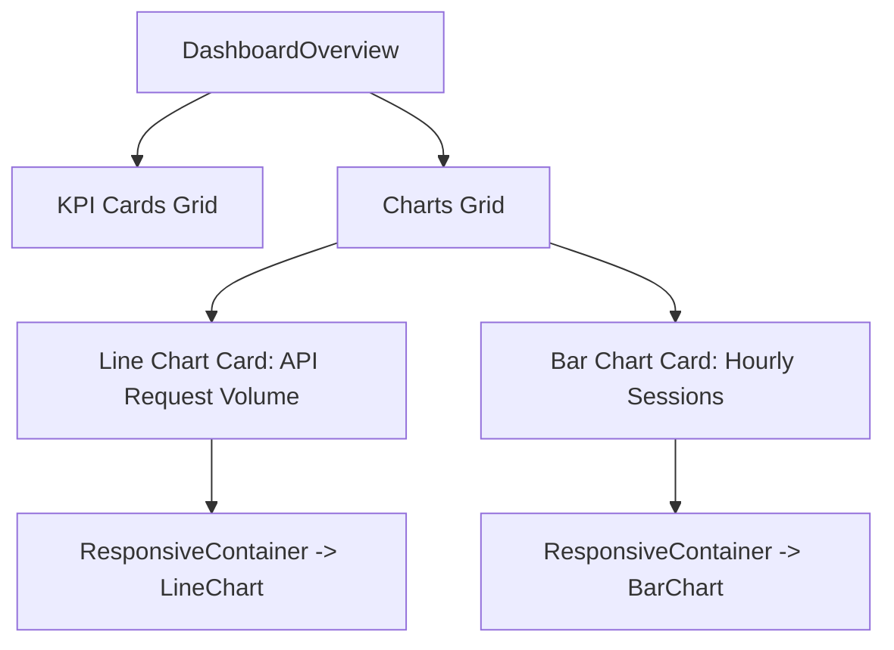

# Phase 1: Interactive Dashboard Graphs - Patterns

**Mapped:** 2026-06-23
**Status:** Approved

## Mapped Component Analogies

Our charts utilize the same base container cards and grid proportions as the KPI cards and the user directory tables.

### 1. Chart Container Card
- **Analog:** Table boundary container or KPI overview card wrapper.
- **Pattern:**
  - Standard card border (`border border-border`), card background (`bg-card`), rounded corners (`rounded-xl`), and internal padding (`p-6`).
  - Section headings with semi-bold typography (`text-base font-semibold`) and description subtext.

### 2. responsive Grid Wrapper
- **Analog:** Layout directories grid list.
- **Pattern:**
  - CSS Grid container (`grid grid-cols-1 lg:grid-cols-2 gap-6`) which renders charts side-by-side on desktop displays but wraps them vertically on mobile viewports.

---

## Pattern Diagram

---
*Phase: 01-interactive-dashboard-graphs*
*Patterns mapped: 2026-06-23*
