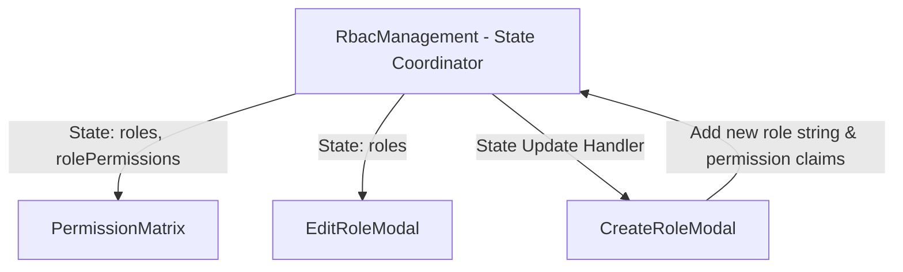

# Phase 2: Custom Role Creator - Patterns

**Mapped:** 2026-06-23
**Status:** Approved

## Mapped Component Analogies

The custom role creator leverages the same modal pattern as the role editing interface but focuses on role registration rather than role assignment.

### 1. State Lifting Pattern
- **State Location:** `RbacManagement.tsx`
- **Dynamic Props:**
  - `PermissionMatrix` renders column columns from the dynamic `roles` state and checkmarks from `rolePermissions` state.
  - `EditRoleModal` populates dropdown values dynamically using `roles`.

### 2. Dialog Component Pattern
- Uses Shadcn Dialog headers, body fields, and absolute positioned close buttons to conform to accessibility standards.
- Handles layout margins and form field spacings cleanly.
