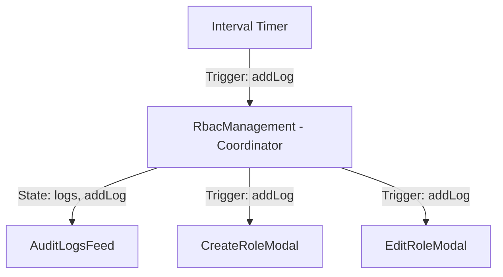

# Phase 3: Audit Logs Feed - Patterns

**Mapped:** 2026-06-23
**Status:** Approved

## Mapped Component Analogies

The Audit Logs panel is styled identically to the Permission Matrix card and lists information chronologically, sharing spacing, padding, and borders.

### 1. Unified Audit Event Dispatcher
- **Pattern:** `addLog(type: string, details: Record<string, string>)`
- **Usage:**
  - `EditRoleModal` triggers a log on saving a user's role.
  - `CreateRoleModal` triggers a log on saving a custom role.
  - Background `setInterval` triggers a log simulating random logins/activities.

### 2. Scrollable Flex Container
- **Pattern:** `max-h-[350px] overflow-y-auto`
- Renders the list items sequentially, pushing newer logs to the top, capped at 20 logs to avoid performance degradation.
