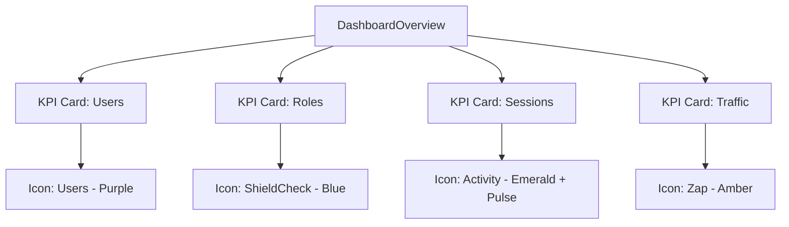

# Phase 3: Dashboard Vitals - Patterns

**Mapped:** 2026-06-23
**Status:** Approved

## Mapped Component Analogies

We map our KPI cards to standard dashboard layouts, utilizing the same design patterns developed in Phase 1 (Layout Shell) and Phase 2 (RBAC Tables).

### 1. KPI Stat Card
- **Analog:** Reusable dashboard information panel.
- **Pattern:** 
  - Outer card wrapper with border, card background, shadow, and rounded edges.
  - Two-column grid layout inside the card header: left side has label and metric value, right side displays the circular-accented Lucide icon.
  - Footer contains the trend percentage or helper subtext.

### 2. Glowing Icon Circle
- **Analog:** Navigational avatar or state indicator badge.
- **Pattern:**
  - A size-10 flex container with full rounding (`rounded-full`), colored border and background matching 10% opacity of the theme hue, holding a size-5 Lucide icon.
  - Active sessions card includes a pulsing animation to emphasize current concurrency.

---

## Pattern Diagram

---

*Phase: 03-dashboard-vitals*
*Patterns mapped: 2026-06-23*
